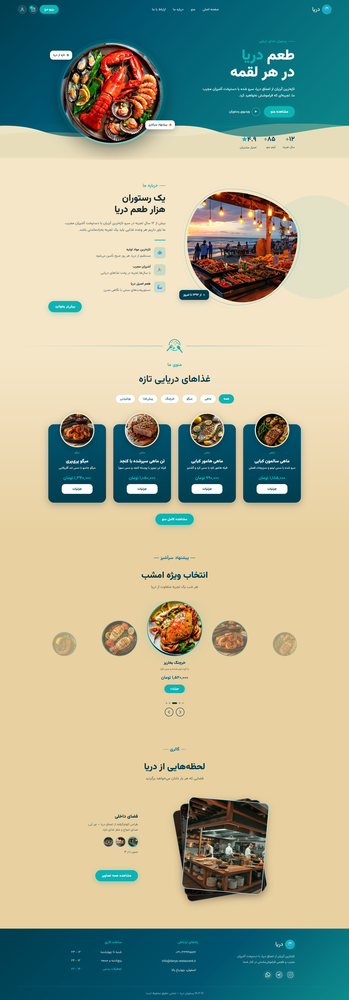
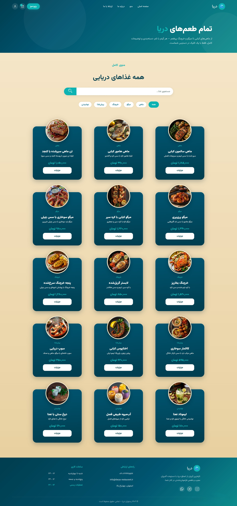
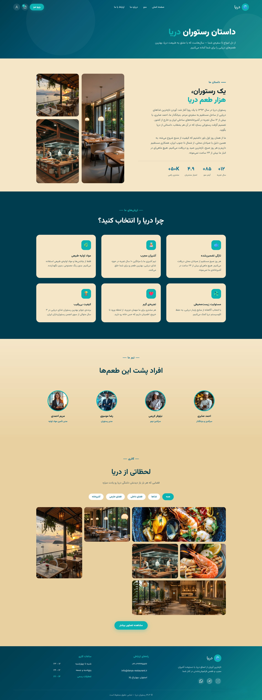
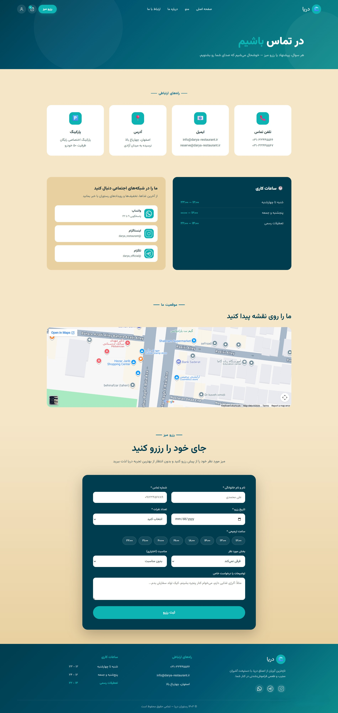
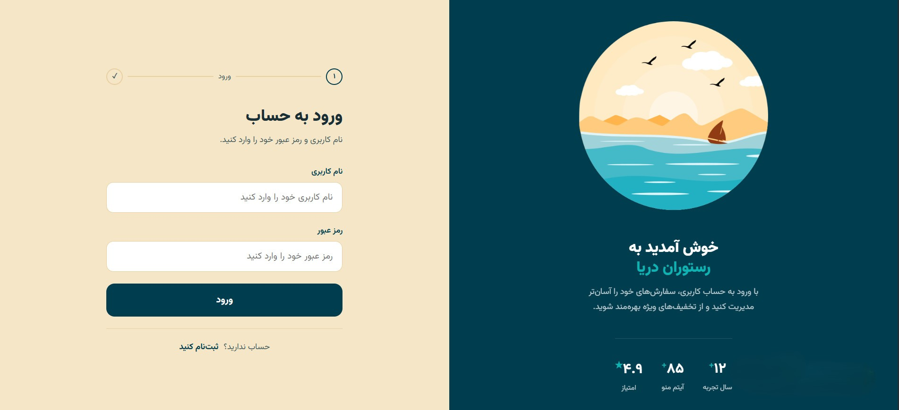
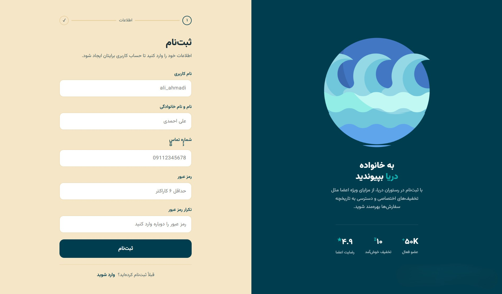

# 🌊 Seafood Restaurant Website

A modern and responsive seafood restaurant website built with **HTML, CSS, and JavaScript**.

The project provides a complete and interactive user experience for exploring the restaurant menu, viewing detailed food information, managing a shopping cart, and accessing customer-related pages such as authentication and profile management.

---

## ✨ Features

### 🏠 Home Page

The landing page introduces the restaurant and provides quick access to its main sections.

* Attractive hero section
* Restaurant introduction
* Featured seafood dishes
* Special offers and recommendations
* Menu category highlights
* Responsive navigation
* Modern visual design

---

### 🍽️ Menu

The menu page allows users to explore the restaurant's available dishes.

Food items are organized into different categories, including:

* 🐟 Fish
* 🦐 Shrimp
* 🦀 Crab
* 🍤 Seafood combinations
* 🥗 Salads
* 🥣 Appetizers
* 🥤 Drinks

Users can search for dishes and navigate through the available categories.

---

### 🔎 Search & Filtering

The menu provides interactive functionality for finding dishes more easily.

Users can:

* Search for a specific food
* Filter foods by category
* Browse available dishes dynamically

---

### 📖 Food Details

Each food item has a dedicated details page.

The food details section provides:

* Food image
* Food name
* Description
* Ingredients
* Cooking method
* Approximate weight / volume
* Price
* Add to Cart functionality

---

### 🛒 Shopping Cart

Users can add food items to their cart and manage their selections.

The shopping cart supports:

* Adding food items
* Removing items
* Changing quantities
* Calculating item totals
* Calculating the overall cart total

Cart interactions are handled dynamically using JavaScript.

---

### 🔐 Authentication

The project includes dedicated authentication pages.

* Login
* Registration

---

### ℹ️ About Us

The About Us page introduces the restaurant and its concept.

It provides information about:

* Restaurant story
* Food quality
* Fresh ingredients

---

### 📞 Contact Us

The Contact Us page provides the restaurant's communication information.

It includes:

* Restaurant address
* Opening hours
* Contact information
* Contact form
* Reservation-related information

---

### ⚠️ Error Pages

Custom error pages are included to provide a consistent experience when something goes wrong.

* `404.html` — Page Not Found
* `503.html` — Service Unavailable

---

## 🎨 Design

The website is designed with a modern seafood-inspired visual identity.

The interface focuses on:

* Clean and modern layouts
* High-quality food imagery
* Consistent visual hierarchy
* Responsive components
* User-friendly navigation
* Interactive elements
* Smooth and engaging user experience

---

## 📱 Responsive Design

The website is designed to provide a consistent experience across different devices.
Responsive behavior is implemented using **CSS media queries** and responsive layout techniques.

---

## 🛠️ Technologies

The project is developed using native web technologies.

### Frontend

* **HTML5** — Structure and semantic markup
* **CSS3** — Styling, layouts, animations, and responsive design
* **JavaScript** — Dynamic functionality and user interactions

### Other

* **JSON** — Data handling
* **Git** — Version control
* **GitHub** — Repository management

> The project does not use frontend frameworks such as React, Vue, Angular, Bootstrap, or Tailwind CSS.

---

## 📂 Project Structure

```text
seafood/
│
├── css/
│   ├── about_us.css
│   ├── auth.css
│   ├── cart.css
│   ├── contact_us.css
│   ├── error_page.css
│   ├── food_detail.css
│   ├── layout.css
│   ├── menu.css
│   ├── profile.css
│   └── style.css
│
├── data/
│   └── ...
│
├── images/
│   └── ...
│
├── js/
│   ├── 503.js
│   ├── about_us.js
│   ├── auth.js
│   ├── cart.js
│   ├── contact_us.js
│   ├── data_loader.js
│   ├── food_detail.js
│   ├── food_detail_redirect.js
│   ├── layout.js
│   ├── layout_profile_patch.js
│   ├── main.js
│   ├── menu.js
│   ├── profile.js
│   └── ...
│
├── 404.html
├── 503.html
├── about_us.html
├── cart.html
├── contact_us.html
├── food_detail.html
├── index.html
├── login.html
├── menu.html
├── profile.html
├── register.html
│
├── package.json
└── README.md
```

---

## 📸 Screenshots

A preview of the main pages and user interfaces of the Seafood Restaurant website.

<div align="center">

### 🏠 Home Page



<br><br>

### 🍽️ Menu



<br><br>

### 📖 About Us



<br><br>

###  📞 Contact Us


<br><br>

### 🔐 Login 



<br><br>

### 📝 Sign Up


</div>

---

## 🎯 Project Goals

The main goal of this project is to create a professional digital presence for a seafood restaurant while providing users with a simple, intuitive, and visually appealing experience.

The website allows users to:

1. Discover the restaurant
2. Explore the food menu
3. Search and filter dishes
4. View detailed food information
5. Add dishes to the shopping cart
6. Manage cart items
7. Register and log in
8. Access their profile
9. Learn more about the restaurant
10. Contact the restaurant
